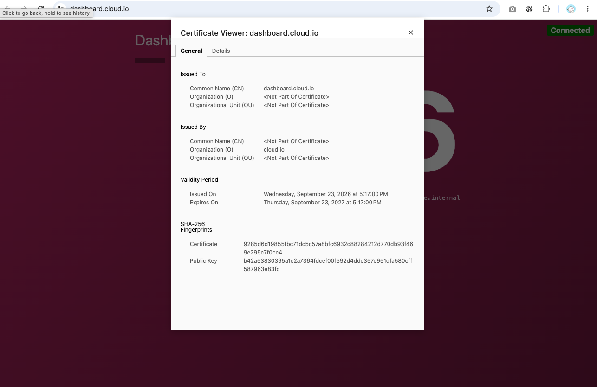
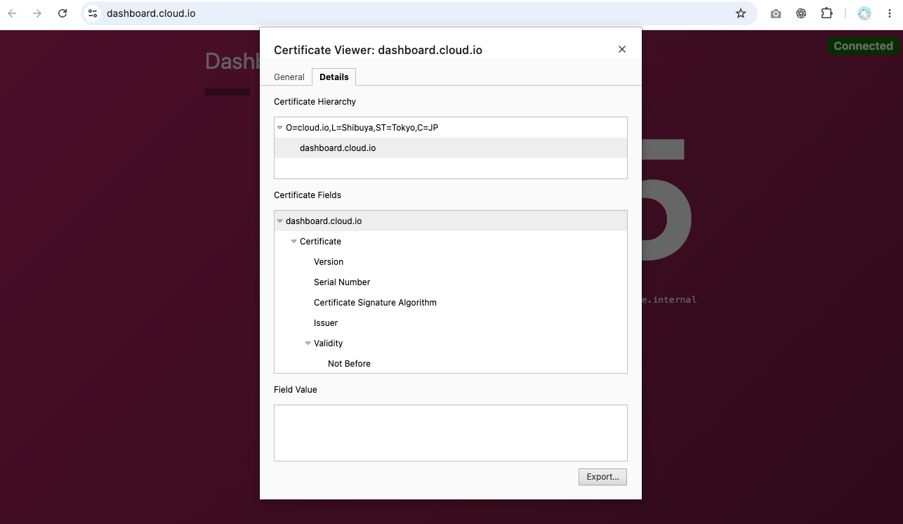

### Step 1 — Generate CA private key
```
➜ openssl genrsa -out root-ca.key 4096
➜ chmod 600 root-ca.key
```
 
### Step 2 — Generate Root CA certificate
```
➜ openssl req -x509 -new -key root-ca.key -sha256 -days 3650 -out root-ca.crt
```
 
### Step 3 — Generate certification for dashboard
```
➜ openssl genrsa -out dashboard.key 2048
➜ chmod 600 dashboard.key
```

### Step 4 - Request CSR
```
➜ openssl req -new -key dashboard.key -out dashboard.csr -subj "/CN=dashboard.cloud.io"
```

### Step 5 - Configure SAN
```
➜ cat > dashboard.ext <<'EOF' \
  subjectAltName=DNS:dashboard.cloud.io \
  basicConstraints=CA:FALSE \
  keyUsage=digitalSignature, keyEncipherment \
  extendedKeyUsage=serverAuth \
  EOF
```

### Step 6 - Sign certificate with Root CA
```
➜ openssl x509 -req -in dashboard.csr -CA root-ca.crt -CAkey root-ca.key -CAcreateserial -out dashboard.crt \
  -days 365 -sha256 -extfile dashboard.ext
```

#### Verify
```
➜ openssl x509 --text --noout --in dashboard.crt
```

### Step 7 - Verify certificate signature with Root CA
```
➜ openssl verify -CAfile root-ca.crt dashboard.crt
```

### Step 8 - Import to ACM
```
certificate body => dashboard.crt
certificate private key => dashboard.key
certificate chain => root-ca.crt
```

### Step 9 - Add certificate to client.
#### If client is browser
```
security -> certificate -> import certificate
```

### Step 10 - Generate certification for counting
#### If client is VM
### Generate certification for counting
```
➜ openssl genrsa -out counting.key 2048
➜ chmod 600 counting.key
```

### Step 11 - Request CSR
```
➜ openssl req -new -key counting.key -out counting.csr -subj "/CN=counting.cloud.io"
```

### Step 12 - Configure SAN
```
➜ cat > counting.ext <<'EOF' \
  subjectAltName=DNS:counting.cloud.io \
  basicConstraints=CA:FALSE \
  keyUsage=digitalSignature, keyEncipherment \
  extendedKeyUsage=serverAuth \
  EOF
```

### Step 13 - Sign certificate with Root CA
```
➜ openssl x509 -req -in counting.csr -CA root-ca.crt -CAkey root-ca.key -CAcreateserial -out counting.crt \
  -days 365 -sha256 -extfile counting.ext
```

#### Verify
```
➜ openssl x509 --text --noout --in counting.crt
```

### Step 14 - Verify certificate signature with Root CA
```
➜ openssl verify -CAfile root-ca.crt counting.crt
```

### Step 15 - Import to ACM
```
certificate body => counting.crt
certificate private key => counting.key
certificate chain => root-ca.crt
```

### Step 16 - Add certificate in VM
```
$ sudo tee /etc/pki/ca-trust/source/anchors/private-ca.pem > /dev/null <<'CACERT' \
  -----BEGIN CERTIFICATE----- \
  root-ca.crt content \
  -----END CERTIFICATE----- \
  CACERT

$ sudo update-ca-trust extract
$ sudo systemctl restart dashboard.service
```

### Result


